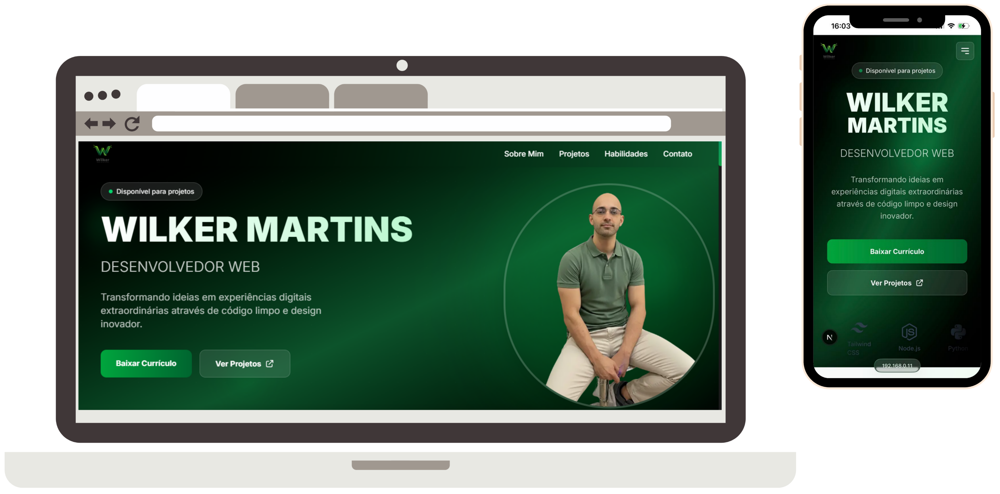

# Portfólio Pessoal - Wilker Martins



Bem-vindo ao repositório do meu portfólio pessoal! Este projeto foi desenvolvido para ser o meu cartão de visitas digital, um espaço centralizado para apresentar minhas habilidades, projetos e informações de contato.

O site foi construído com as mais modernas tecnologias do ecossistema front-end, focando em performance, design responsivo e uma experiência de usuário fluida e agradável.

**[Acesse a versão ao vivo aqui!](URL_DO_SEU_PORTFOLIO)** ---

## ✨ Funcionalidades Principais

* **Design Moderno e Responsivo:** Interface adaptável para uma ótima experiência em qualquer dispositivo, seja desktop, tablet ou mobile.
* **Animações e Transições:** Efeitos sutis de animação para tornar a navegação mais dinâmica e interativa.
* **Seções Detalhadas:**
    * **Sobre Mim:** Uma breve introdução sobre minha trajetória e paixão por desenvolvimento.
    * **Projetos:** Uma galeria com meus trabalhos mais relevantes, incluindo um projeto em destaque.
    * **Habilidades:** Um resumo das tecnologias e ferramentas que domino.
    * **Contato:** Um formulário funcional para facilitar a comunicação.
* **Carrossel de Habilidades:** Um carrossel infinito que exibe as tecnologias com as quais trabalho.
* **Performance Otimizada:** Construído com Next.js para garantir carregamento rápido e ótima performance (SEO).

---

## 🚀 Tecnologias Utilizadas

Este projeto foi desenvolvido utilizando as seguintes tecnologias:

* **[Next.js](https://nextjs.org/):** Framework React para produção, com foco em performance e renderização no lado do servidor (SSR).
* **[React](https://react.dev/):** Biblioteca para construir interfaces de usuário interativas.
* **[TypeScript](https://www.typescriptlang.org/):** Superset do JavaScript que adiciona tipagem estática ao código, aumentando a robustez e a manutenibilidade.
* **[Tailwind CSS](https://tailwindcss.com/):** Framework de CSS utility-first para criar designs customizados de forma rápida e eficiente.
* **[React Icons](https://react-icons.github.io/react-icons/):** Biblioteca para incluir ícones populares nos projetos React.
* **[ESLint](https://eslint.org/):** Ferramenta para análise estática de código, garantindo a padronização e a qualidade do código.

---

## 🛠️ Como Executar o Projeto Localmente

Para rodar este projeto na sua máquina local, siga os passos abaixo.

### Pré-requisitos

Certifique-se de ter o [Node.js](https://nodejs.org/en) (versão 18.18.0 ou superior) e um gerenciador de pacotes (NPM, Yarn ou PNPM) instalados.

### Passos

1.  **Clone o repositório:**
    ```bash
    git clone [https://github.com/wilkermartins/portfolio.git](https://github.com/wilkermartins/portfolio.git)
    ```

2.  **Acesse o diretório do projeto:**
    ```bash
    cd portfolio
    ```

3.  **Instale as dependências:**
    ```bash
    npm install
    ```
    *ou, se preferir usar Yarn:*
    ```bash
    yarn
    ```

4.  **Inicie o servidor de desenvolvimento:**
    ```bash
    npm run dev
    ```
    *ou com Yarn:*
    ```bash
    yarn dev
    ```

5.  **Abra o navegador:**
    Acesse [http://localhost:3000](http://localhost:3000) no seu navegador para ver o projeto em execução.

## 📞 Contato

Gostou do meu trabalho ou tem alguma pergunta? Sinta-se à vontade para entrar em contato!

* **LinkedIn:** [https://www.linkedin.com/in/wilker-martins/](https://www.linkedin.com/in/wilker-martins/)
* **GitHub:** [https://github.com/wilkermartins](https://github.com/wilkermartins)
